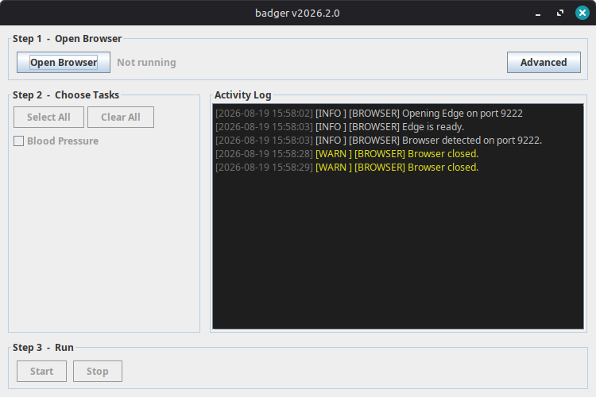

# Badger

A small Java application to help automate repetitive tasks within Indici.

Download the latest release from the [releases page](https://github.com/Buried-In-Code/Badger).

## Usage

1. Open Edge through the Badger window.
2. Login to Indici and navigate to the recalls page.
3. Select the type of recalls you wish to be completed.
4. Click **Start**

## Audit data

Badger records task activity and browser traces under `~/.badger`

## Screenshots

Main Screen

